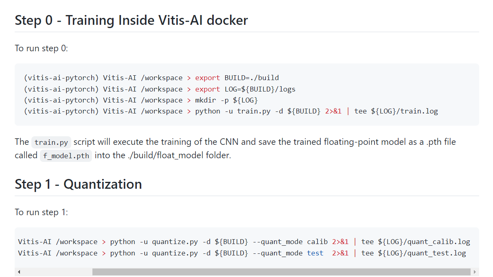

# Trials and Errors in implementing ELM on KV260
I finished this project based on an open project [KV260_Vitis_AI_examples](https://github.com/DeepYNet/KV260_Vitis_AI_examples).This helps me to generate a pytorch model(.pth) and quantize, compile it to be read on Kria-DPU.

## Basic ideas about ELM and IELM

ELM(Extreme Learning Machine) is a machine learning algorithm which has almost the same architecture as CNN. The key difference lies in how the params were got. Since readers must be familiar with how CNNs are trained, I am briefing how ELMs were trained.

- Random generating parameters with normal distribution
- Only the last layer’s params are trainable, so we freeze the prior layers.
- The formula to represent ELM is , where H is the output of previous hidden layers. Beta is the output layer param, T is expected output.
- Compute hidden layer Matrix H, so , which “solves” the params instead of finding minimum using GD(Gradient Descent). 

## Benefits and Problems 

### Benefits

- `fast` training process and `low computing cost`
- can be deployed on`Edge Device` and `retrain` ELM params
- With DPU on KV260, the inference of previous layers can be `accelerated`.

### Problems

- the model on KV260 is quantized using Int8, there will be accuracy loss.
- the xmodel can only be generated on `Host PC` , not on KV260
- In fact, inferences of the previous layers is separated with the last layer of ELM, since the limit of the device. The dataflow is connected using saved processed .`npy` files. You will see this in the code.

### All in All

This might be the **first** ELM implementation on KV260. I take advantage of KV260 DPU and based on its low CPU computing power to design the flow of ELM firstly, even if I finished **the process of ELM and IELM**, the method is **not elegant enough**. Besides, because of the INT8 quantization of Params. The **Accuracy cannot align with** CPU based FP32 ELMs. There will be a further research on this.(For I won’t be able to finish before the deadline on 4.1) 


## Step One:  Run the Original Scripts in KV260_Vitis_AI_examples 

The intention is to get the `quant_info.json file`, please rename it to `CNN_quant_info.json`, which will be overwrite if not changed. The usage will be talked later.

You should finish Step 0 and Step 1.

Note that there is no need for you to clone that projeect.



## Step Two: Generate ELM model

### generate float model


run the following command in **Vitis-AI docker**:

```shell
conda activate vitis-ai-pytorch
export BUILD=./build
export LOG=${BUILD}/logs
python -u generate_model.py -d ${BUILD} 2>&1 | tee ${LOG}/train.log 
```
This will give you a model in `build/float_model/f_model.pth`.This model is different from the original project, for I **delete the last layer**(from shape 64 to shape 10). As you can see, the random generated model has very low accuracy on MNIST testset.

At this time, you will get a quant_info.json for the new model. I named ELM_CNN. For the quant_info.json of ELM model, you must change the params of quantization according to the orignal same layers. The quantization method of vai_q **will read this json file as configs**. Please note not all orignal configs are used, for we have different CNN architecture.

For example:

```json
"ELM_CNN::network.0.weight":[8,null] to "ELM_CNN::network.0.weight":[8,7] 
```


<center class="half">
    
</center>

The clearer images are in dir `images`.

## Step Three: Quantize Model and Compile for Target KV260

The last lines of generate model will quantize the ELM model, with out calibration.


The name of quantized model is `ELM_CNN_int.xmodel`.Next, use the compile.sh to get xmodel targetting KV260.

```shell
source compile.sh kv260 ${BUILD} ${LOG} ELM_CNN
```


We can read from `meta.json` file to know it is a new ELM model.


## Step Four:  Software Implementation

### Trial with CPU based [IELM](https://github.com/ankitpatel21/Incremental-Extreme-Learning-Machine-IELM)

try file `Test_IELM.ipynb` to prove it is feasible to use ELM to classify MNIST digits.

Train_data is provided with BaiduNetDisk [Link](https://pan.baidu.com/s/120QkmT9OeIvvwZEDm1_hlA)
with code `rv0l `
results on MNIST, with KV260 CPU core:

```
Training Loss in mean square error: 0.024322
Training Accuracy: 0.794983
Total Time require for Training 296.864780 Seconds

Test Loss in mean square error: 0.024017
Test Accuracy: 0.802200
Total Time require for Test 0.449784 Seconds
```

Compared with CNN based Gradient Descent methods, it is faster but less accurate.

### Kria DPU based method

The Process are as follows:

- using pre-compiled .xmodel to get the output, which is the same as the output before the last layer of original model.
- the mid-output will be saved as .npy files and will be used later by ELM.
- The ELM model fits the mid-output, then train and test the model to get accuracy, loss, etc.

The above process can be found in ELM.ipynb

## Results Analysis

The reason I did not get expected accuracy result is that we have INT8 network at previous steps, and ELM is FP32.
Compared the mid-output(left) with original data(right), it is has more repeated values, which gives no valuable information. So there is no way that ELM can deal with it without some data processing.
I have no idea at this moment, hope I can figure it out later.

<center class="half">
    
</center>
